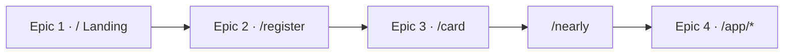

# Part 1: End-User Journey & Task Model

Obsidian task list for the Gutguard Lifestyle member funnel. Converted from the end-user journey into four epics that match the routes a guest actually walks.

House spelling in UI: **Gutguard**. Visual source of truth: Doctors / vault — not Academy or other prototypes.

Related: [[TODO-Lifestyle]] · [[00 - GutGuard Design System]] · [[01 - Visual Foundations]] · [[Foundations/Dialects]] · [[03 - Portable CSS Starter]] · [[01 - Canonical Stack]] · [[02 - Supabase Conventions]]

---

## Inherited locks

Every task below **repeats** these locks. Do not treat them as optional QA.

### HCI lock

| Constraint | Rule |
|---|---|
| Touch target | Minimum **44px × 44px** on every tap/click control (buttons, nav, flip, steppers, switches, accordion heads, file pickers). |
| Focus | Visible `:focus-visible` outline using **`var(--gold)`** (`#B08D5B`; portable CSS alias `--gg-gold`). Never remove the outline without an equivalent replacement. |
| ARIA | Use real state attributes: `aria-invalid`, `aria-describedby`, `aria-live`, `aria-expanded`, `aria-busy`, `aria-current`, `aria-modal` as the control requires. |
| Disabled | Never opacity-alone. Change background **and** color (bone-soft / ink-4). |
| Motion | Honor `prefers-reduced-motion` on flip, confetti, drawers, welcome, spinners. |
| Copy | Uppercase micro-labels (`.gg-eyebrow`). Fraunces for display, Inter Tight for UI. |

### Stack lock

| Layer | Rule |
|---|---|
| Framework | **Next.js App Router only** (`app/`). Pages router forbidden. |
| Language | Strict TypeScript. |
| Auth | Cookie sessions via `@supabase/ssr`, refreshed in root `middleware.ts`. No trusting `localStorage` as authorization. |
| Data | Supabase Postgres + **RLS**. No Prisma, no Drizzle, no ORM. |
| Forms | Zod + react-hook-form + `@hookform/resolvers`. Re-validate in Server Actions. |
| UI | GutGuard **portable CSS** custom properties. **No Tailwind. No shadcn.** |
| Icons | `lucide-react` outline, consistent stroke. |
| Secrets | `SUPABASE_SERVICE_ROLE_KEY` and `lib/supabase/admin.ts` stay server-only. Never `NEXT_PUBLIC_`. Never process payments in the browser. |
| Dialects | One dialect per screen. Do not mix radius policies. |

### Dialect map

| Epic / screen | Dialect |
|---|---|
| Landing / welcome | Editorial marketing + commerce CTAs |
| Register | Editorial booth |
| Door card | Editorial ceremonial |
| Nearly free + `/app/*` + sheets | Commerce |

Canonical shell **900px**. Mobile main column max ~440px. Desktop shell max ~1240–1320px.

---

## Epic 1 — `/` Landing

Guest arrives at Ginhawa. They understand the gift (a card and an invitation, nothing to pay to start) and choose to begin the Lifestyle Protocol.

**Routes:** `/` (gift) · `/welcome` (plain forum)  
**Files:** `app/page.tsx` · `app/welcome/page.tsx` · `components/funnel/LandingView.tsx` · `components/lifestyle/WelcomeOverlay.tsx`

### Journey

1. First-run overlay states the offer.
2. Hero + ceremonial/commerce card explains “card and invitation.”
3. Trust stats and three-step explainer reduce uncertainty.
4. FAQ accordion answers selling / payment fears.
5. Primary CTA takes them to `/register`.

### Tasks

- [ ] **E1-T01** Ship first-run welcome overlay so a new guest hears the offer before the page competes for attention. `#task #epic/landing`
  - Route: `/` · `/welcome`
  - HCI: Overlay is `role="dialog"` `aria-modal="true"` with labelled title; dismiss/continue control ≥ 44×44; `:focus-visible` outline `var(--gold)`; `prefers-reduced-motion` on entrance.
  - Stack: App Router client island only for overlay state; portable CSS ceremonial tokens; persist `welcome_seen` through a Server Action + Supabase profile when a cookie session exists — not as auth.
  - Done when: Keyboard users can complete or dismiss without a mouse; reduced-motion users get no full-screen animation trap.

- [ ] **E1-T02** Render the gift landing (`/`) in editorial dialect with a commerce pill CTA. `#task #epic/landing`
  - Route: `/`
  - HCI: Primary CTA ≥ 44×44; gold focus ring; link wrapping a button still exposes a single tab stop; no opacity-only hover.
  - Stack: Server Component page in `app/page.tsx`; portable CSS (`--bone`, `--blue`, `--ink`, `--gold`); Fraunces display + Inter Tight UI; no Tailwind.
  - Done when: “Ready now? Start my Lifestyle Protocol” goes to `/register` and survives 320px width without clipping.

- [ ] **E1-T03** Render the plain Ginhawa forum landing (`/welcome`) without mixing ceremonial radii into the commerce card. `#task #epic/landing`
  - Route: `/welcome`
  - HCI: Same 44×44 CTA and gold focus as gift landing; eyebrow micro-labels remain uppercase and readable.
  - Stack: App Router `app/welcome/page.tsx`; one dialect per screen; copy uses **Gutguard**.
  - Done when: Gift vs plain variants share the CTA path but not radius policy.

- [ ] **E1-T04** Show trust stats (members, centers, research, USAID) as scanable facts, not decoration. `#task #epic/landing`
  - Route: `/` · `/welcome`
  - HCI: Stat cards are not fake buttons; if tappable later, ≥ 44×44 and `aria-label`.
  - Stack: Static content from a typed module; no ORM; portable CSS stat card.
  - Done when: Stats remain legible in the ~440px mobile column.

- [ ] **E1-T05** Explain the three funnel steps: get card → invite a friend → points pay for first Gutguard. `#task #epic/landing`
  - Route: `/` · `/welcome`
  - HCI: Step cards are readable without hover; if a step becomes a link, gold focus + 44×44 hit area.
  - Stack: App Router; typed `FUNNEL_STEPS`; no Tailwind grid utilities.
  - Done when: A first-time guest can restate the offer without opening FAQ.

- [ ] **E1-T06** Provide short answers (FAQ accordion) for “do I pay / do I have to sell?” `#task #epic/landing`
  - Route: `/` · `/welcome`
  - HCI: Accordion heads ≥ 44×44; `aria-expanded` reflects open state; `:focus-visible` `var(--gold)`; chevron is decorative (`aria-hidden`).
  - Stack: Client accordion only; content is static TypeScript; lucide outline icon.
  - Done when: Keyboard users can open/close every item; selling is explicitly optional.

- [ ] **E1-T07** Offer next-place links (Telegram, Facebook, full site) without trapping focus. `#task #epic/landing`
  - Route: `/` · `/welcome`
  - HCI: Text links have gold focus-visible and adequate line-height; `rel="noreferrer"` on external targets.
  - Stack: Plain anchors; no third-party widgets; no secrets in the browser.
  - Done when: External links open safely and remain usable at 44px row height.

---

## Epic 2 — `/register` Auth & Zod

The guest becomes a member. Identity is collected, validated, and stored as a **cookie session**. They leave with a session, not a `localStorage` mock as the source of truth.

**Route:** `/register`  
**Files:** `app/register/page.tsx` · `components/funnel/RegisterForm.tsx` · `lib/schemas/auth.ts` · `lib/actions/auth.ts` · `lib/supabase/server.ts`

### Journey

1. Editorial booth: name, mobile, credential.
2. Client Zod via react-hook-form; server Zod in the Server Action (never trust the client).
3. `createClient()` from `lib/supabase/server.ts` writes Auth cookies.
4. Errors are announced, not toasted-only.
5. Success **server-redirects** to `/card`.

### Tasks

- [ ] **E2-T01** Keep `/register` as an editorial booth — one dialect, ruled fields, no commerce radius mix. `#task #epic/register`
  - Route: `/register`
  - HCI: Labels bound with `htmlFor`; controls ≥ 44×44; gold focus on inputs and submit; uppercase eyebrows.
  - Stack: App Router; portable CSS editorial tokens; no Tailwind/shadcn.
  - Done when: The booth reads as a ceremonial form, not a dashboard.

- [ ] **E2-T02** Author `lib/schemas/auth.ts` with Zod for **name**, **mobile**, and **password** (explicit strength). `#task #epic/register`
  - Route: `/register` (schema)
  - HCI: Strength rules are human-readable in `aria-describedby` hint text, not only in thrown errors.
  - Stack: Strict TypeScript Zod schema in `lib/schemas/`; PH mobile `09…` / `+639…`; password ≥ 8 with upper, lower, and a digit.
  - Done when: Weak passwords fail with field-level messages; valid PH numbers normalize for Auth.

- [ ] **E2-T03** Bind the form with react-hook-form + `@hookform/resolvers/zod` against that schema. `#task #epic/register`
  - Route: `/register`
  - HCI: `aria-invalid` and `aria-describedby` on every invalid field; form-level `aria-live="polite"` for action errors; `noValidate` so RHF owns UX.
  - Stack: Client form; Zod resolver; no inline styles for error color — use `--error` / portable error class.
  - Done when: Submitting empty fields never hits the network; screen readers hear the first error.

- [ ] **E2-T04** Create Server Action `lib/actions/auth.ts` that re-validates with Zod and calls `supabase.auth.signUp()` on the cookie server client. `#task #epic/register`
  - Route: Server Action (POST from `/register`)
  - HCI: Map Auth failures to calm, non-technical copy; never dump raw stack traces into the booth.
  - Stack: `"use server"`; `createClient()` from `lib/supabase/server.ts` (`@supabase/ssr`); email/password (or equivalent metadata) + `options.data` for name/mobile; **no admin/service-role** in this action; no ORM.
  - Done when: A valid payload creates an Auth user and Set-Cookie headers; duplicate identity returns a field/form error.

- [ ] **E2-T05** Keep the submit control size-stable while the action runs. `#task #epic/register`
  - Route: `/register`
  - HCI: Button remains ≥ 44×44; **do not swap the label** for a longer loading string; `aria-busy="true"`; disabled uses bone-soft fill + ink-4 text (not opacity); gold focus still visible if focus remains.
  - Stack: `useActionState` / transition; lucide outline spinner in a **fixed 20×20 slot**; portable CSS only.
  - Done when: Layout does not jump on pending; assistive tech hears that the card is being created.

- [ ] **E2-T06** On successful sign-up, set the Supabase cookie session and **server-redirect** to `/card`. `#task #epic/register`
  - Route: `/register` → `/card`
  - HCI: No flash of the booth after success; if redirect fails, `aria-live` error stays on the form.
  - Stack: `redirect("/card")` from the Server Action (not `router.push` as the source of truth); cookie `getAll`/`setAll`; middleware can refresh later.
  - Done when: `/card` can read `user_metadata.name` from `getUser()`; `gg-lifestyle-session` is not required for the name on the door.

- [ ] **E2-T07** Treat `localStorage` mock as a **dev fallback only**, never as authorization. `#task #epic/register`
  - Route: `/register` · `/app/*`
  - HCI: Mock and live paths present the same booth errors and targets.
  - Stack: Cookie session via `@supabase/ssr`; RLS still default-deny; service role never in the browser.
  - Done when: Empty env is documented; a real session is what `/app` middleware checks.

---

## Epic 3 — `/card` Door Interaction

The new member receives a ceremonial card they can show at the door. Staff scan the back. Claiming turns the guest card into a Lifestyle Member card.

**Routes:** `/card` · `/card?claimed=1` · `/nearly` (bridge)  
**Files:** `app/card/page.tsx` · `components/funnel/DoorCard.tsx` · `components/lifestyle/FlipCard.tsx` · `components/funnel/NearlyFree.tsx`

### Journey

1. Front: member name on ceremonial paper.
2. Flip: QR + card number for staff (`Ipakita ito sa pintuan`).
3. Continue → claimed; confetti if motion allowed.
4. Nearly-free ledger: points toward the first ₱4,500 order.
5. CTA enters the member hub.

### Tasks

- [ ] **E3-T01** Load the door card from the cookie session (name from Auth metadata / `profiles`). `#task #epic/card`
  - Route: `/card`
  - HCI: Name is in a real heading; loading fallback is a `main`, not a spinner-only void.
  - Stack: App Router Server Component reads `createClient().auth.getUser()`; strict TypeScript; no ORM.
  - Done when: The face shows the registered name after sign-up, not a seed persona.

- [ ] **E3-T02** Make the flip target a real button with an accessible name. `#task #epic/card`
  - Route: `/card`
  - HCI: Entire flip surface is a `<button>` ≥ 44×44 (card is larger); `aria-label="Flip member card"`; `aria-pressed` or text cue for front/back; gold focus-visible; `prefers-reduced-motion` disables 3D flip.
  - Stack: Client island; portable CSS `.gg-flip`; no Tailwind transforms.
  - Done when: Keyboard users can flip; reduced-motion users still reach the QR side.

- [ ] **E3-T03** Show staff QR + monospace card number on the back. `#task #epic/card`
  - Route: `/card`
  - HCI: QR has sufficient contrast on paper; number is selectable text, not only an image.
  - Stack: Typed `card_no` from profile; portable CSS ceremonial back; no third-party QR SaaS secrets in the client.
  - Done when: A staff member can scan or read the number in bright outdoor light.

- [ ] **E3-T04** Claim the card (`Continue`) and persist claimed state. `#task #epic/card`
  - Route: `/card` → `/card?claimed=1`
  - HCI: Continue ≥ 44×44; gold focus; confetti gated by reduced-motion; `aria-live` optional confirmation.
  - Stack: Server Action updates `profiles.claimed` + phase under RLS; App Router navigation.
  - Done when: Refresh keeps claimed; unauthenticated users cannot write another member’s row.

- [ ] **E3-T05** After claim, explain that this is now the Lifestyle Member card. `#task #epic/card`
  - Route: `/card?claimed=1`
  - HCI: Heading change is visible and in the accessibility tree; CTA ≥ 44×44.
  - Stack: Same page, query or profile flag; portable CSS; Gutguard spelling.
  - Done when: Copy matches claimed vs unclaimed without a layout jump that hides the CTA.

- [ ] **E3-T06** Bridge to nearly-free: points are not cash; they only pay for the member’s own first order. `#task #epic/card`
  - Route: `/nearly`
  - HCI: Progress rail has an accessible `label`; invite rows are not tiny hit targets; CTA ≥ 44×44 gold focus.
  - Stack: Commerce dialect; points from `profiles` / `point_events` via Server Components or actions; no ORM.
  - Done when: Guest can enter `/app/health` from this screen; ledger math is explained in plain language.

---

## Epic 4 — `/app/*` Member Hub & BASE gating

The member lives in Health / Team / Story. **My Team** and **GEMA** stay closed until BASE Activation is complete. Middleware refuses `/app` without a cookie session.

**Routes:** `/app` · `/app/health` · `/app/team` · `/app/story`  
**Sheets:** Order · Settings · BASE · GEMA · GG-VERSE · Story share · QR · Invite picker  
**Files:** `app/app/*` · `middleware.ts` · `lib/supabase/middleware.ts` · `components/shell/*` · `components/overlays/*` · `lib/actions/member.ts` · `supabase/migrations/`

### Journey

1. Cookie gate: no session → `/`.
2. Welcome into My Health: doses, supply, BASE badge.
3. BASE drawer: five steps; events to book.
4. Team roster unlocks only when all five BASE steps are done.
5. GEMA locked by UI **and** `lifestyle_base_complete()` (RLS / RPC).
6. Story share with consent; order sheet stays mock (no browser payments).

### Tasks

- [ ] **E4-T01** Protect every `/app` route in middleware with a validated cookie session. `#task #epic/member`
  - Route: `/app`, `/app/health`, `/app/team`, `/app/story`
  - HCI: Unauthenticated users never see a flash of member chrome; redirect is immediate.
  - Stack: Root `middleware.ts` + `createServerClient` from `@supabase/ssr`; `getUser()` (not `getSession()`) to refresh tokens; `getAll`/`setAll` cookies; redirect to `/`.
  - Done when: No cookie → 307 `/`; valid cookie → hub; tokens refresh on public routes too.

- [ ] **E4-T02** Frame the hub: sidebar (≥900px), masthead, mobile segmented nav, commerce bottom bar. `#task #epic/member`
  - Route: `/app/*`
  - HCI: Nav links and icon buttons ≥ 44×44; `aria-current="page"` or `is-active` plus accessible name; gold focus; bottom bar does not cover toasts.
  - Stack: App Router layout `app/app/layout.tsx`; portable CSS commerce dialect; lucide outline icons.
  - Done when: Health / Team / Story are reachable by keyboard on mobile and desktop.

- [ ] **E4-T03** My Health: log today’s doses, attach proof, see days of supply. `#task #epic/member`
  - Route: `/app/health`
  - HCI: Log / Taken buttons ≥ 44×44; `aria-pressed` or distinct text for taken vs log; file picker labelled; gold focus; `aria-live` for proof saved.
  - Stack: Server Actions write `dose_logs` + Storage under RLS; Zod not required for booleans but types stay strict; no ORM.
  - Done when: Refresh keeps the log when Supabase env is set; mock path is clearly non-authoritative.

- [ ] **E4-T04** BASE Activation sheet: five steps with visible done state. `#task #epic/member`
  - Route: overlay `base` from `/app/*`
  - HCI: Step toggles ≥ 44×44; `aria-pressed` / checkbox semantics; drawer `aria-modal`; gold focus on close and book actions; reduced-motion on sheet.
  - Stack: Persist `base_progress` via Server Action; steps 0–4; no client-only lock for GEMA.
  - Done when: Toggling a step survives reload; event “Reserved” is announced.

- [ ] **E4-T05** Gate **My Team** until BASE is complete. `#task #epic/member`
  - Route: `/app/team`
  - HCI: Empty state CTA ≥ 44×44; does not look disabled-via-opacity; gold focus; copy explains the lock.
  - Stack: Client may hide roster; **server** still enforces via `lifestyle_base_complete()` / RLS — not UI hiding alone.
  - Done when: Incomplete BASE cannot invite through a Server Action; complete BASE shows roster + invite picker.

- [ ] **E4-T06** Invite picker: search contacts, send invite, pending points. `#task #epic/member`
  - Route: overlay from `/app/team`
  - HCI: Search field 44px tall; row actions ≥ 44×44; `aria-invalid` if search pattern added; live region for “Invite sent”.
  - Stack: `invites` + `point_events` inserts under RLS; Zod if free-text names are collected; portable CSS commerce sheet.
  - Done when: Duplicate invites don’t double-write; pending vs real points are distinct in the ledger.

- [ ] **E4-T07** My Story: community quotes + share wizard with consent. `#task #epic/member`
  - Route: `/app/story`
  - HCI: Share CTA ≥ 44×44; outcome chips ≥ 44×44; consents are real checkboxes with labels; `aria-invalid` on missing required fields; gold focus.
  - Stack: Zod + RHF in `lib/schemas/story-share.ts`; Server Action inserts `stories` under RLS; no Tailwind.
  - Done when: Share is blocked without both consents; submitted story is the member’s own row only.

- [ ] **E4-T08** Lock GEMA until `lifestyle_base_complete()` is true. `#task #epic/member`
  - Route: overlay `gema`
  - HCI: Locked empty state with ≥ 44×44 “Continue BASE”; never grey-out by opacity alone.
  - Stack: RPC `lifestyle_base_complete()` (security invoker); UI lock is secondary to server lock.
  - Done when: A crafted client request cannot read GEMA-only data before BASE is done.

- [ ] **E4-T09** GG-VERSE remains invitation copy — sponsor sends the link. `#task #epic/member`
  - Route: overlay `ggverse`
  - HCI: Ceremonial card is not a fake disabled control; CTA ≥ 44×44; gold focus.
  - Stack: No Academy admin routes here; outbound link only; no service role.
  - Done when: Copy does not imply the member can self-provision GG-VERSE.

- [ ] **E4-T10** Settings: notifications + capsules/day (2–3), QR full-size. `#task #epic/member`
  - Route: overlay `settings` · `qr`
  - HCI: Switch and steppers ≥ 44×44; `aria-checked` on the switch; stepper has `aria-label`; gold focus.
  - Stack: Persist to `profiles` via Server Action; Zod range 2–3; QR from `card_no`.
  - Done when: Capsule count cannot go below protocol minimum; QR dialog is labelled.

- [ ] **E4-T11** Order sheet stays **mock** — no payment processing in the browser. `#task #epic/member`
  - Route: overlay `order` · bottom bar
  - HCI: Quantity stepper ≥ 44×44; submit ≥ 44×44; `aria-live` for “Order queued”; gold focus.
  - Stack: No Maya/keys in client; no `NEXT_PUBLIC_` payment secrets; Server Action may record intent later.
  - Done when: Place-order cannot charge a card; copy says mock until an approved processor lands.

---

## Out of scope (do not put on this board)

| Item | Home |
|---|---|
| `/admin`, staff check-in, trainer queue | gentrep-academy |
| Real GEMA training UI | Academy |
| Maya checkout / webhooks | Later Lifestyle pass |
| SMS OTP | After an SMS provider is configured |

---

## Definition of done (Part 1)

A guest can walk **Landing → Register (Zod + cookie Auth) → Door card → Nearly free → Member hub** on a phone-sized viewport, with:

- every control ≥ **44×44**
- every focus ring in **`var(--gold)`**
- ARIA state on forms, dialogs, accordions, and locks
- `/app/*` refused without a Supabase cookie
- BASE gating enforced in **Postgres/RLS**, not only in the UI
- **no Tailwind, no ORM, no service-role key in the browser**
