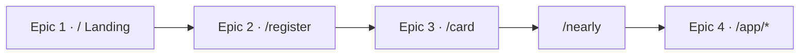

# Part 1: End-User Journey

A guest walks four rooms. Tasks live on the epic notes so checkboxes stay in one place.

Related: [[Bien To Do]] · [[00 - Locks]] · [[Epic 1 Landing]] · [[Epic 2 Register]] · [[Epic 3 Door Card]] · [[Epic 4 Member Hub]] · [[Epic 5 Admin RBAC]] · [[Epic 6 User Lifecycle]] · [[Epic 7 Orders]] · [[Epic 8 Story Moderation]]

## The walk

1. **Landing** — Ginhawa gift or forum. A card and an invitation. Nothing to pay to start. CTA to register.
2. **Register** — Name, mobile, credential. Zod on client and server. Cookie session. Redirect to the door.
3. **Door** — Ceremonial card, flip to QR, staff scan, claim. Nearly-free points toward the first order.
4. **Member hub** — Health / Team / Story. Team and GEMA stay closed until BASE is complete. `/app` is refused without a cookie.

## Definition of done

A guest can complete the walk on a phone-sized viewport with:

- every control ≥ **44×44**
- every focus ring in **`var(--gold)`**
- ARIA state on forms, dialogs, accordions, and locks
- `/app/*` refused without a Supabase cookie
- BASE gating in **Postgres/RLS**, not only in the UI
- **no Tailwind, no ORM, no service-role key in the browser**

## Out of scope

| Item | Home |
|---|---|
| `/admin` users / orders / stories | This Lifestyle repo (Epics 5–8) |
| Academy CMS, staff check-in, trainer queue | gentrep-academy |
| Real GEMA training UI | Academy |
| Hosted Maya pay page | Later — queue + webhook are in Epic 7 |
| SMS OTP | After an SMS provider is configured |
