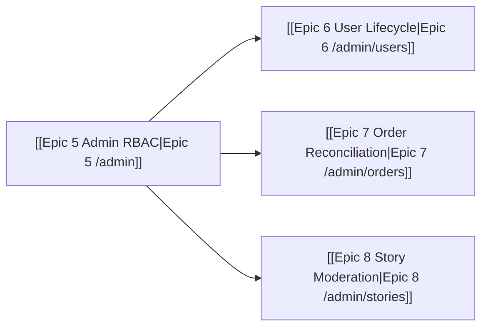

# Part 2: Admin Management System

Operators run the Lifestyle backend. High-density tables, low memory load, strict RBAC. Tasks live on the epic notes so checkboxes stay in one place.

Related: [[Bien To Do]] · [[00 - Locks]] · [[Epic 5 Admin RBAC]] · [[Epic 6 User Lifecycle]] · [[Epic 7 Order Reconciliation]] · [[Epic 8 Story Moderation]]

Codex map (Part 2 Epic 1–4 → board Epic 5–8 so they do not collide with Part 1):

| Codex | Board | Route |
|---|---|---|
| Epic 1 Admin RBAC | [[Epic 5 Admin RBAC]] | `/admin/*` |
| Epic 2 User lifecycle table | [[Epic 6 User Lifecycle]] | `/admin/users` |
| Epic 3 Order + Maya reconcile | [[Epic 7 Order Reconciliation]] | `/admin/orders` |
| Epic 4 Story queue | [[Epic 8 Story Moderation]] | `/admin/stories` |

## Objective

Manage the operational backend of the Gutguard Lifestyle platform. Goal-oriented tasks. Natural computing: show state, do not make the operator remember it. Protect member data with server-side RBAC.

## The walk (operator)

1. **Gate** — Cookie session + admin role. Non-admin lands on a safe public route. No table flash.
2. **Users** — Search and filter who registered, who claimed, who finished BASE, who can open GEMA.
3. **Orders** — Refill pacing and Maya webhook reconcile. Pending vs reconciled is labelled, not colour-only.
4. **Stories** — Queue. Bulk approve or reject. Member feed shows approved rows only.

## Definition of done

An admin can work the three tables on a phone-sized viewport with:

- every control ≥ **44×44**
- every focus ring in **`var(--gold)`**
- admin dialect (radius **0**) — no commerce pills on `/admin/*`
- `/admin/*` refused without a validated cookie **and** an admin role
- role re-checked in every Server Action (not UI hide alone)
- `lib/supabase/admin.ts` imported only from server files
- Maya secrets and service role never `NEXT_PUBLIC_`
- **no Tailwind, no ORM, no payment processing in the browser**

## Out of scope

| Item | Home |
|---|---|
| Academy `/admin`, staff check-in, trainer queue | gentrep-academy |
| Real GEMA training UI | Academy |
| Member funnel and hub | [[01 - Part 1 End-User Journey]] |
| SMS OTP | After an SMS provider is configured |
