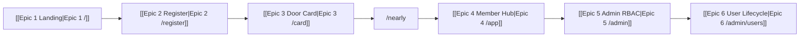

# Bien To Do

Folder note for the Gutguard Lifestyle board.

Drop this **folder** at:

`C:\Users\najee\OneDrive\Documents\Obsidian Vault\Bien To Do\`

If `Bien To Do.md` still sits at the vault root as a **file**, rename that file first (Obsidian cannot keep a file and a folder with the same name). Then copy this folder in.

## Notes in this folder

- [[00 - Locks]] — HCI + stack locks on every task
- [[01 - Part 1 End-User Journey]] — journey narrative
- [[Epic 1 Landing]] — `/` and `/welcome`
- [[Epic 2 Register]] — `/register` Auth & Zod
- [[Epic 3 Door Card]] — `/card` door interaction
- [[Epic 4 Member Hub]] — `/app/*` + BASE gating
- [[Epic 5 Admin RBAC]] — `/admin/*` cookie + `lifestyle_is_admin()`
- [[Epic 6 User Lifecycle]] — `/admin/users` member directory

## Vaults (read only)

- [[00 - OWNER — Read only]]
- [[00 - GutGuard Design System]] · [[01 - Visual Foundations]] · [[Foundations/Dialects]]
- [[00 - GutGuard Tech Stack]] · [[01 - Canonical Stack]] · [[02 - Supabase Conventions]]

House spelling in UI: **Gutguard**.
