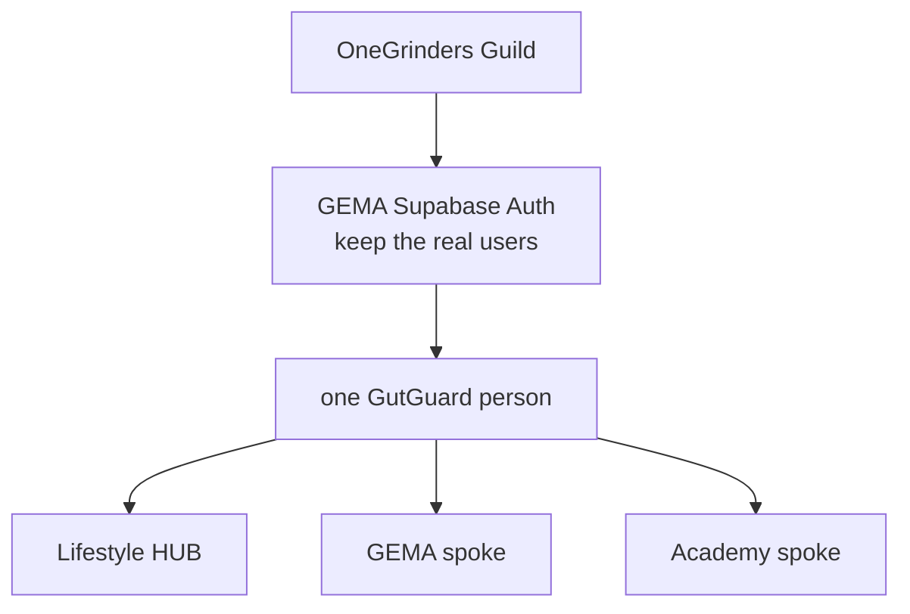

# One Account

GutGuard identity board. **Lifestyle is the hub. GEMA and Academy are spokes. One login for all — GEMA Auth plus OneGrinders.**

Canonical folder on Najee’s machine:

`C:\Users\najee\OneDrive\Documents\GutGuard\One Account\`

Copy this whole folder there (not inside Tech Stack, not inside Design System). Cloud agents read the product-repo copy at `docs/obsidian/One Account/`.

**Current change:** [[Change 2 - Shared login engine]]

[[Change 1 - Staging identity freeze]] is done on Staging. Change 2 is in progress — username or email on all three apps. Do not start Change 3 until Change 2 is proven.

## Always

[[00 - Session gate]] — read first, before every task, and again after every task.  
[[00 - Locks]] · [[01 - Decisions]] · [[02 - Architecture]] · [[03 - Identity model]] · [[04 - UX]]

## Changes (do in order)

1. [[Change 1 - Staging identity freeze]] — **done on Staging**
2. [[Change 2 - Shared login engine]] — **current**
3. [[Change 3 - Public profiles]]
4. [[Change 4 - Lazy product rows]]
5. [[Change 5 - Hub chrome]]
6. [[Change 6 - Shared domain SSO]]

## Owner steps in only when

Listed on each Change. Typical: copy this folder to `C:\Users\najee\OneDrive\Documents\GutGuard\One Account\`, Vercel env for Preview, custom domains, production cutover. Agents must not invent extra owner work.

## Repos

| Product | GitHub | Role |
|---|---|---|
| Lifestyle | `atc1989/GutGuard-Life-Style` | Hub. Member OS. |
| GEMA | `atc1989/GEMA` | Spoke. Identity spine + OneGrinders. Real users. |
| Academy | `atc1989/gentrep-academy` | Spoke. Training. Reset Auth ok. |
