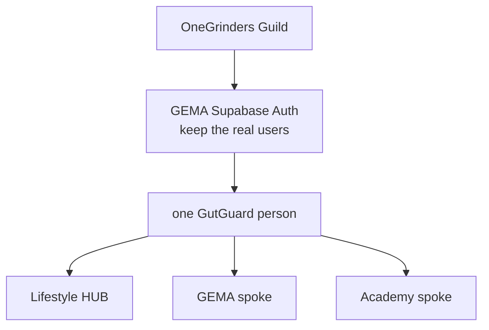

# One Account

GutGuard identity board. **Lifestyle is the hub. GEMA and Academy are spokes. One login for all — GEMA Auth plus OneGrinders.**

Canonical folder on Najee’s machine:

`C:\Users\najee\OneDrive\Documents\Obsidian Vault\One Account\`

Copy this whole folder there (not inside Tech Stack, not inside Design System). Cloud agents read the product-repo copy at `docs/obsidian/One Account/`.

**Current change:** [[Change 9 - Member chrome identity]] — planned, **not
implemented**. One Account Changes 1 through 6b remain **done**. Gentrep
Academy Change 8 remains **CLOSED**. Do not skip to other leftovers while
Change 9 is current.

Change 1 is checked done — proven on Staging 2026-08-28, production Auth untouched.  
Change 2 is checked done — Staging shared-login proof recorded 2026-09-03 (`TEST_MANCERA` + `demo.admin` email across Lifestyle, Academy, GEMA Preview; OneGrinders-unavailable safe failure on Academy Preview).
Change 3 is checked done — Staging, 2026-09-04. Person rows on both sides of the spine.
Change 4 is checked done — Staging, 2026-09-04. Card and trainee rows are created on first visit, never at signup; the owner confirmed the card by signing in. Academy stays "not enrolled" on Staging until its catalog lands there — recorded under *Left open* on that note, and not a fault in the Change.

That proof is a **Preview** proof — Preview env, Staging `fxdsnacuonfvutdquogb`. A `main`-branch deployment loads **Production** env, so a Staging username fails there by design, not by fault. See [[Change 2 - Shared login engine]].



## Always

[[00 - Session gate]] — read first, before every task, and again after every task.  
[[00 - Locks]] · [[01 - Decisions]] · [[02 - Architecture]] · [[03 - Identity model]] · [[04 - UX]]

## Changes (do in order)

1. [[Change 1 - Staging identity freeze]] — **done** (Staging, 2026-08-28)
2. [[Change 2 - Shared login engine]] — **done** (Staging proof, 2026-09-03)
3. [[Change 3 - Public profiles]] — **done** (Staging, 2026-09-04)
4. [[Change 4 - Lazy product rows]] — **done** (Staging, 2026-09-04)
4b. [[Change 4b - Academy on Staging]] — **done** (Staging, 2026-09-05)
4c. [[Change 4c - One registration]] — **done** (2026-09-07), copy included
5. [[Change 5 - Hub chrome]] — **done** (Staging, 2026-09-07) — cross-app links, and Settings name/mobile closed the same day
6. [[Change 6 - Shared domain SSO]] — **done** (Staging, 2026-09-07)
6b. [[Change 6b - Staging on the real domain]] — **done** (2026-09-07), opened from a failed Change 6 test that turned out to be environment scoping
9. [[Change 9 - Member chrome identity]] — **planned** (2026-09-12), not coded. Lifestyle shell identity from `public.profiles`. There is no One Account Change 7 or 8; those numbers were Academy-only.

## Proven end to end, 2026-09-07

On `lifestyle.gutguard.ph`, `gema.gutguard.ph` and `gentrep.gutguard.ph`, all
three serving the `staging` branch against Staging Auth `fxdsnacuonfvutdquogb`:

```text
sign in on Lifestyle, open GEMA        already signed in
sign in on Lifestyle, open Academy     already signed in
sign out on Lifestyle                  signed out on both spokes
register with ?returnTo=<academy>      lands on Academy
register with ?returnTo=<look-alike>   lands on /card, silently
sidebar Elsewhere                      Events and Academy, both cross over signed in
Gutguard home on both spokes           back to the hub, signed in
```

Owner-verified in a browser, not by tests alone — which is what every
*Done when* on these notes asks for.

## Where the three apps actually are, 2026-09-12

All three custom domains serve Production `main` against Production Auth
`rvwseybgimmewuoccecu`:

```text
gema.gutguard.ph        Production   main
lifestyle.gutguard.ph   Production   main
gentrep.gutguard.ph     Production   main
```

Staging remains separately available as Vercel Preview aliases of the
`staging` branch (Deployment Protection / SSO still on), pointed at Staging
Auth `fxdsnacuonfvutdquogb`. Custom domains were switched in place — do not
remove and re-add them. The 2026-09-07 Staging-on-domain proof below is
historical; [[Change 6b - Staging on the real domain]] has the addendum.

## What is actually left

- ~~**The production cutover**~~ **Done 2026-09-12.** All three custom
  domains are Production. Gentrep Academy Change 8 is CLOSED.
- **Settings name/mobile.** Shipped in Lifestyle Change 5 and is on Production
  `main`. Duplicate-mobile collision remains a construction proof. Staging
  `staging` branch still lacks SettingsIdentity — Change 9 step 0 branches
  from `origin/main`.
- **Change 9 (current):** member chrome still says "Member" under a guest
  client session. Plan: `docs/change9-plan.md` in gentrep-academy;
  implement in Lifestyle only. See [[Change 9 - Member chrome identity]] and
  [[Change 5 - Hub chrome]].
- ~~**Registration asks for a PH mobile, and requires it.**~~ **Answered by the
  owner, 2026-09-07: PH only, and it stays required.** The one thing that
  changed is that `639171234567` is now accepted alongside `09171234567` and
  `+639171234567` — three spellings of the same number. An Academy-only trainee
  is still asked for a Philippine mobile, and someone outside the Philippines
  still cannot register. That is the decision, not an oversight.

## Owner steps in only when

Listed on each Change. Typical: copy this folder to `C:\Users\najee\OneDrive\Documents\Obsidian Vault\One Account\`, Vercel env for Preview, custom domains, production cutover. Agents must not invent extra owner work.

## Repos

| Product | GitHub | Role |
|---|---|---|
| Lifestyle | `atc1989/GutGuard-Life-Style` | Hub. Member OS. |
| GEMA | `atc1989/GEMA` | Spoke. Identity spine + OneGrinders. Real users. |
| Academy | `atc1989/gentrep-academy` | Spoke. Training. Reset Auth ok. |
